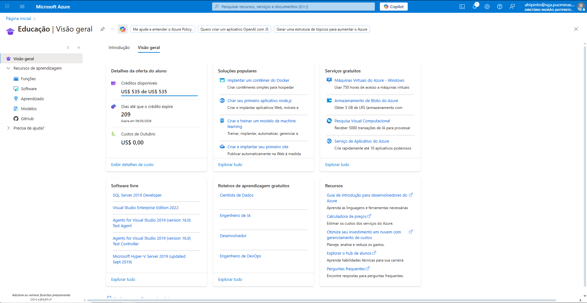
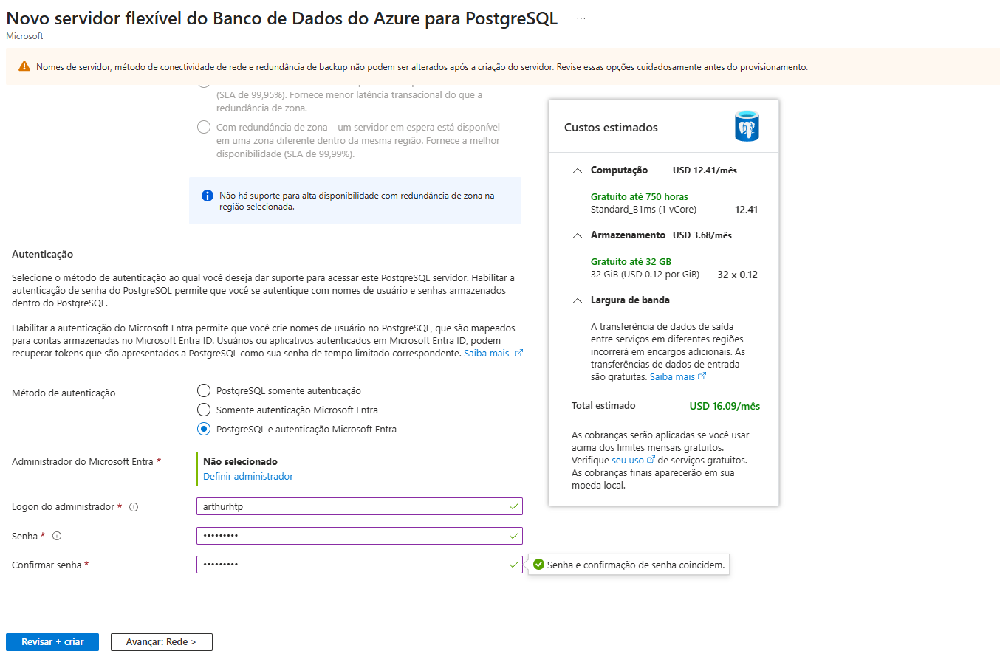
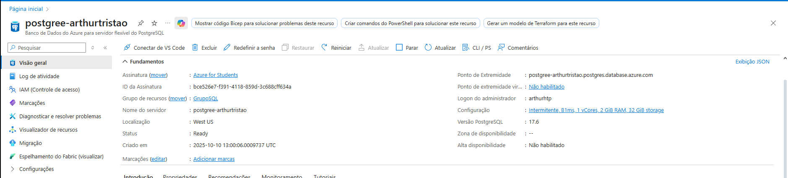
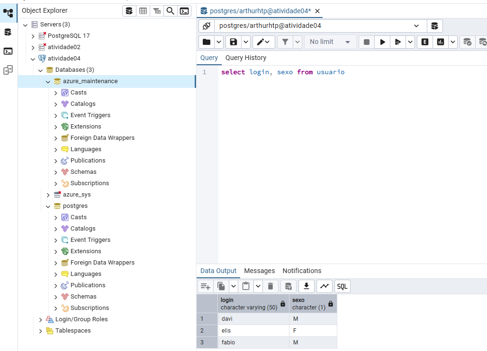
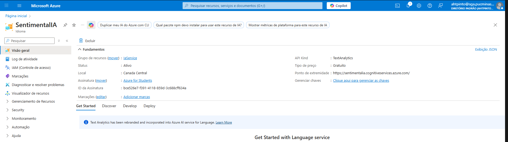

# Exercício 4
---
## Informações do Aluno

**Nome:** Arthur Henrique Tristão Pinto

**Matrícula:** 895494

**Disciplina:** TI2

**Descrição:** Implementação na Azure do Banco pgSQL em Nuvem e IA como serviço

**Instruções** Rode o arquivo Principal.java e abra o index.html ou rode o localhost/3333 no navegador

---

# 🧱 PRODUTO 1 — Ativar Conta no Azure

---

# 🗄️ PRODUTO 2 — Criação do Banco de Dados PostgreSQL no Azure

---

# 🤖 PRODUTO 3(Opção b) — Serviço Cognitivo Pronto (Análise de Sentimentos)

## O Código Java se encontra na pasta ServicoIA
